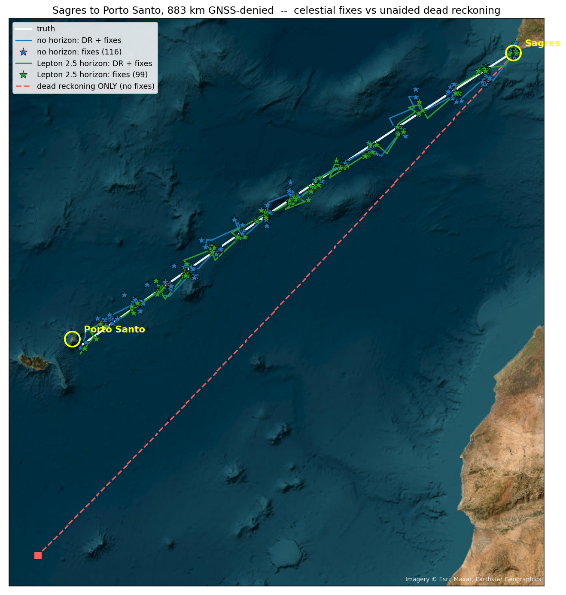
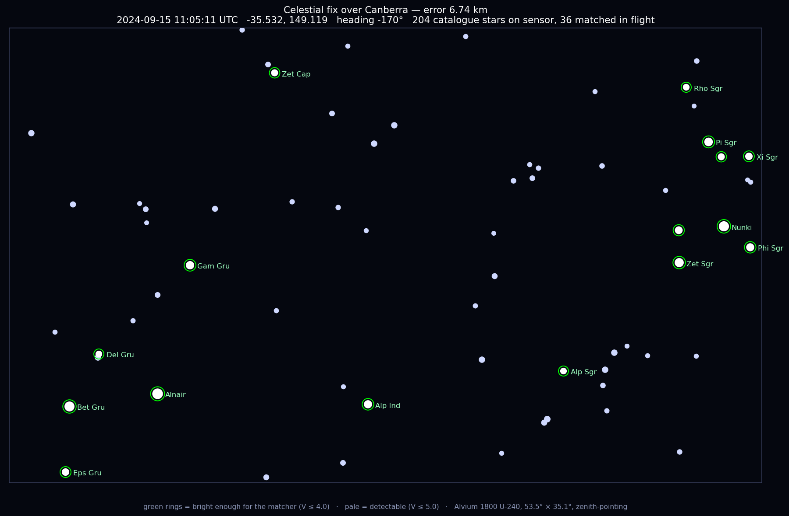
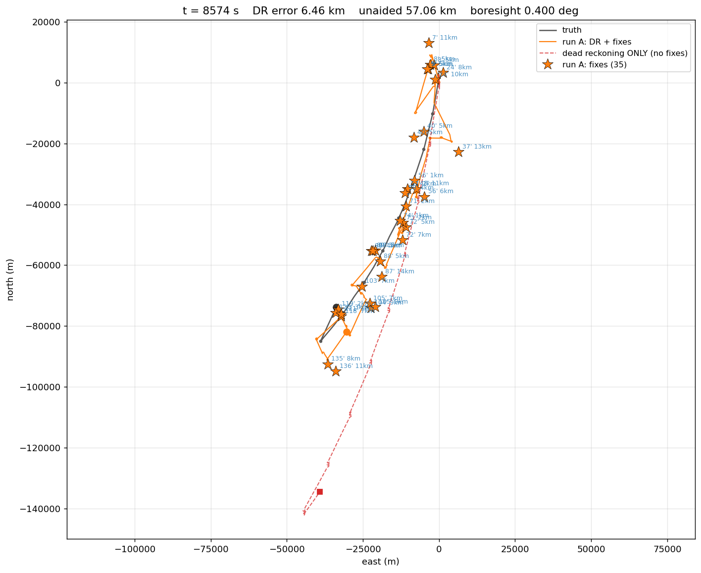
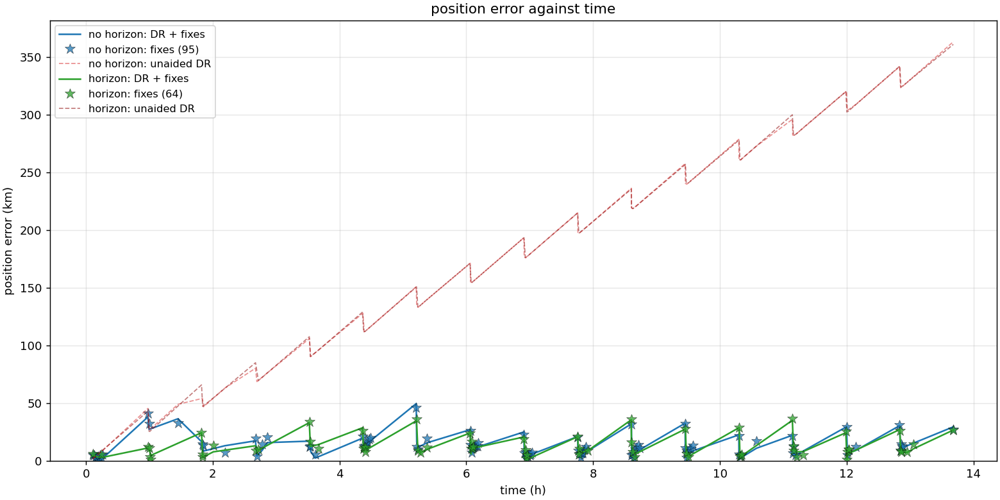
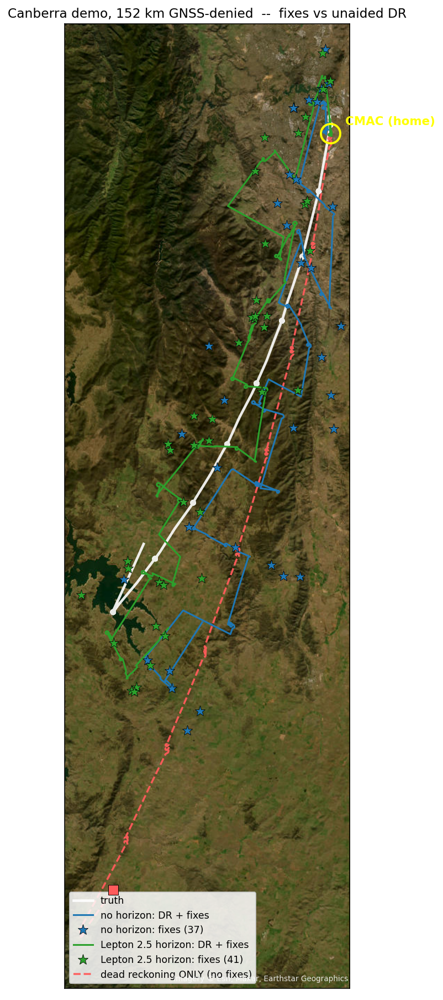
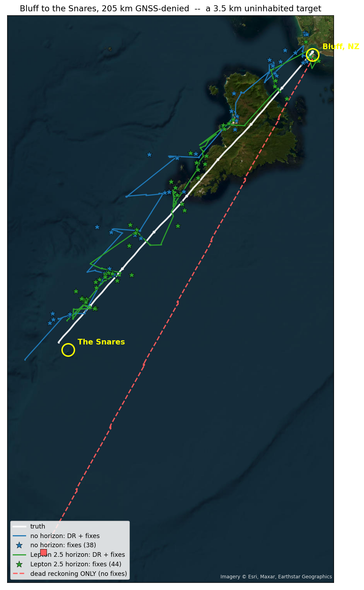
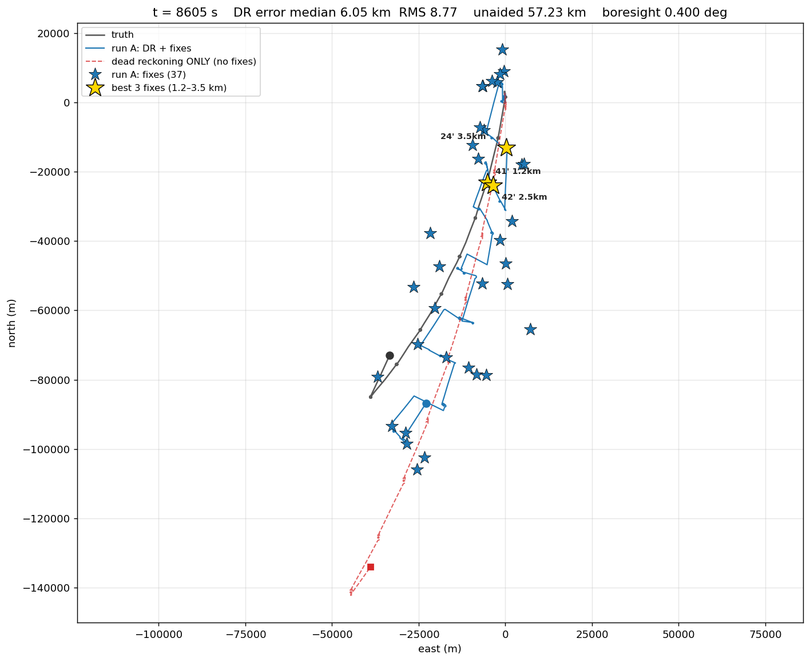
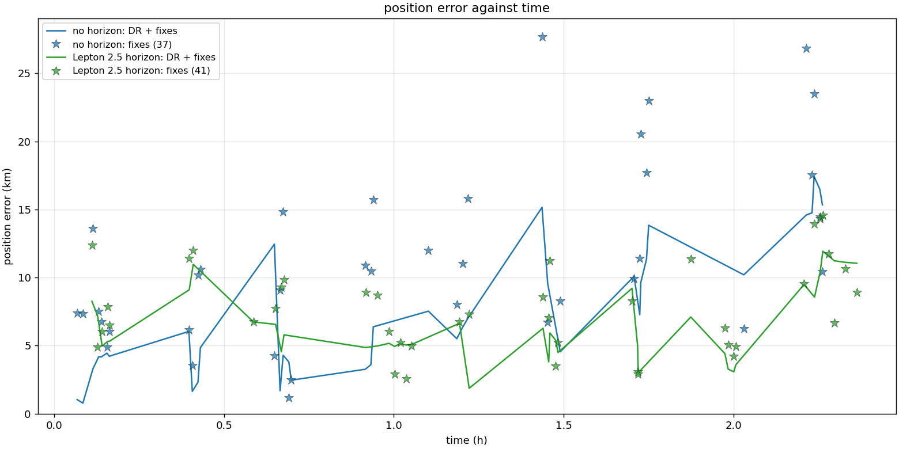

# Celestial Navigation System

A GNSS-denied celestial navigation system for fixed-wing aircraft, inspired by
the SR-71's Astro-Inertial Navigation System and proven out in ArduPilot SITL.
It is built for flying over terrain with no visual features to fix against —
ocean, desert, ice.

A zenith-pointing strapdown star camera and air-data dead reckoning, fused so
that absolute position error stays **bounded indefinitely** while the aircraft
emits nothing. One camera, no vertical reference, no extra sensors.

This is a **navigation and simulation library**; hardware is out of scope. It
implements the estimator, the star pipeline and the sensor fusion end to end,
and exercises them in a repeatable simulation, against a MAVLink replayer, and
against ArduPilot SITL.



**883 km across open Atlantic, GNSS denied.** Red is dead reckoning with no
celestial fixes — it ends **346 km** out. The aided track holds a 6.9 km median
and finds Porto Santo, an 11 km island, with margin.



**What the camera actually matches.** The zenith-pointing Alvium's
53.5° × 35.1° field, reconstructed from the same Yale catalogue the matcher
uses. Green rings are bright enough to identify (V ≤ 4.0), pale dots are
detectable but too faint. 36 were matched in flight and that fix came out
6.74 km from truth.

---

## Contents

- [How it works](#how-it-works)
- [Build and test](#build-and-test)
- [Running it](#running-it)
- [Results](#results)
- [Known limitations](#known-limitations)
- [References](#references)

---

## How it works

A zenith-pointing camera takes a frame. Stars are detected, centroided and
matched against the Yale catalogue, which turns the frame into a set of
identified directions in camera axes. Those directions, plus the AHRS attitude,
are all the fix needs — **the IMU is the only vertical reference in the system**,
and that is what makes everything else follow.

Each frame then feeds two solvers that share the same matched stars. The first
computes a **position**: every identified star gives a plane through Earth's
centre, and the zenith is where those planes intersect. The second computes a
**rotation** from the same pairs, which yields the camera **mounting** and the
**heading** — a celestial compass that costs almost nothing to add, because the
stars are already identified.

A single frame's position fix is poor, around **43 km**. The reason is the
vertical reference: the AHRS tilt error and the camera mounting error are both
*body-fixed*, so they displace the fix in a fixed direction relative to the
aircraft. Averaging frames on a straight leg does not help, because the error
does not change.

**Flying a circle does.** Over 360° of heading a body-fixed error points every
direction in turn and averages to nothing, which takes the fix to about
**4 km**. That is why the orbit is the estimator rather than a flight-planning
detail, and why **the aircraft must manoeuvre in order to navigate**. The
mission is therefore legs separated by fix orbits: the orbits make fixes, the
legs are where dead reckoning drifts. Mounting and heading are pulled out
*before* the average, since they are per-frame quantities while the fix is not,
and the mounting is calibrated once at departure where the bank is lowest.

What survives the average is the part of the attitude error that is **not**
body-fixed. That residual is the system's floor, and one degree of it is 111 km
of position.

Between orbits a four-state Kalman filter dead-reckons on airspeed and wind,
using the celestial heading. Each absolute fix enters as a position
measurement, gated against the filter's own covariance so a bad fix cannot
overwrite a good prior. The filter's displacement is fed back into the orbit
solver to compensate for the aircraft moving during the sweep — displacement
only, never position, so it is not a circular dependency. Dead reckoning alone
grows without limit; the fixes bound it. That is the whole claim.

### The algorithms, and where they live

| module | job |
|---|---|
| `types` | `Geodetic`, `Epoch`, units, haversine. **Frame conventions live here** |
| `star_catalog` | Yale BSC5 subset, proper motion, magnitudes, common names |
| `sky_model` | RA/Dec to ECEF/NED, refraction, sub-stellar points, **and the position solver** |
| `attitude` | DCM/Euler, `kabsch`, `averageRotation`, and `StarAidedAttitude`, a gyro-bias MEKF |
| `imaging` | render, detect, centroid, match |
| `orbit` | the estimator: orbit fix, mount calibration, compass, simulators |
| `deadreckon` | 4-state air-data filter (N, E, wind_N, wind_E) |
| `prior_net` | optional: ONNX detection prior via `cv::dnn` |

**Position solve** (`sky_model`) — plane-intersection weighted least squares,
SVD-solved, wrapped in RANSAC with a 3-star minimal set. Residuals are
normalised by `sin(zenith)` so the tolerance means an angle, and a fixed seed
makes it deterministic.

**Attitude** (`attitude`) — Kabsch/Wahba SVD for the camera-to-NED rotation
from matched pairs; chordal rotation averaging for combining per-frame mount
estimates.

**Orbit averaging** (`orbit`), three variants — naive mean of zenith vectors,
heading-weighted mean, and a small-circle fit whose axis is the position and
whose angular radius is the misalignment.

**Star pipeline** (`imaging`) — median + MAD robust thresholding,
connected-component labelling, Gaussian-fit centroiding (5-parameter
Gauss-Newton, verified against the Cramér-Rao bound), nearest-neighbour
matching with a 2x ambiguity guard.

**Sky model** (`sky_model`) — ERFA precession/nutation/sidereal time, proper
motion, Bennett and Saemundsson refraction with elevation-dependent weighting.

**Dead reckoning** (`deadreckon`) — 4-state Kalman filter, air-data driven,
with a wind random walk that absorbs systematic airspeed and heading error.
Fixes are gated on a Mahalanobis distance against the filter's own covariance.

Tools live in `tools/`: `pipeline` (nav logic, no MAVLink), `celestial_node`
(live UDP node), `fake_sitl` (replayer), `analyse_log`, `visualise`, `bench`,
`gen_dataset`. See [tools/README.md](tools/README.md).

**The celestial core is independent of dead reckoning.** `deadreckon` consumes
fixes; nothing in the core includes it. Delete it and the fix still works.

### Sensor models

Everything the simulator injects, and where the numbers come from.

| term | value | source |
|---|---|---|
| camera | 1936x1216, 53.5 deg FOV, 10 Hz | Alvium 1800 U-240 |
| boresight error | 0.4 deg, uncalibrated at departure | assumed |
| AHRS tilt bias | 0.25 / 0.15 deg | assumed |
| AHRS tilt drift | 0.15 deg, tau = 60 s | the paper's Figure 5 |
| manoeuvre coupling | 0.0041 | **measured in SITL, GNSS-denied** |
| centroid noise | 10 arcsec | assumed |
| wind | 5 m/s | the paper's flight conditions |

**Manoeuvre coupling** deserves a note. An accelerometer senses specific force,
so in a coordinated turn its vertical is pulled toward the aircraft's own down
axis and the AHRS under-reads the bank. `ErrorModel::ahrs_turn_coupling` is the
fraction that survives EKF3's compensation. Measured: **0.0009 GPS-aided,
0.0041 denied** — denial costs 4.6x, because centripetal compensation needs
velocity and airspeed is a poorer substitute than GPS.

The **orbit radius** is a genuine trade-off. A fix wants a short period, because
drift only averages out if the orbit is quick against its correlation time; a
calibration wants low bank, because manoeuvre coupling puts a bank-proportional
tilt into the AHRS. At the measured coupling: 150 m gives 8.78 km, **250 m gives
7.27 km**, 400 m gives 8.76 km, 600 m gives 10.23 km. 250 m is the optimum at
both the aided and denied coupling, so the choice is not sensitive to which is
right.

### Optional extras

All off by default, all tested in their absent state.

**Horizon sensor** — an LWIR camera looking forward gives a *non-inertial*
vertical reference: it observes the AHRS tilt error directly and, unlike an
accelerometer, is not confused by the acceleration of a turn, which is exactly
when the orbit needs it most. Worth about 30% on fix quality; see
[Results](#7-a-horizon-sensor-is-worth-about-30). A short moving average on the
tilt measurement is worth a further 37%, but the window must stay under ~3 s.

**Star-aided attitude** (`analyse_log --star-aided`) — a 6-state multiplicative
EKF estimating gyro bias from absolute star attitude. Star directions in ECEF do
not depend on position, so the *sequence* of star attitudes observes gyro bias
even though a single fix cannot separate tilt from position. On a real log it
improves attitude by 2.4x (0.95 → 0.40 deg) and leaves the fix essentially
unchanged.

**Learned detection prior** (`prior_net.hpp`) — an ONNX model run through
`cv::dnn`, producing a **prior** rather than a decision. It lowers the detection
threshold between `threshold_k` and `threshold_k_low`; the detection still has
to clear a significance floor computed from actual photons, and the centroid is
always measured on the original image. So it **cannot hallucinate** a star and
**cannot delete** one. `testPriorIsBounded` asserts the exact equivalence: the
worst an adversarial model can do is move you to an operating point you could
have chosen yourself. 7.3 ms at 1/4 resolution. See
[scripts/README.md](scripts/README.md).

---

## Build and test

```bash
sudo apt install cmake libeigen3-dev liberfa-dev
cmake -S . -B build -DCMAKE_BUILD_TYPE=Release
cmake --build build -j
ctest --test-dir build
```

Two optional dependencies, both auto-detected:

```bash
# MAVLink -- needed for celestial_node and fake_sitl
git clone --depth 1 https://github.com/mavlink/c_library_v2 ~/c_library_v2
cmake -S . -B build -DMAVLINK_DIR=~/c_library_v2

# OpenCV -- only for running an ONNX detection prior through cv::dnn
sudo apt install libopencv-dev
```

Without MAVLink those two targets are skipped with a message that is easy to
miss — check `ls build/`. Without OpenCV, `PriorNet` compiles to a stub and
nothing else changes. Both build paths are tested.

| binary | covers |
|---|---|
| `test_roundtrip` | geometry, sub-stellar points, position solver, RANSAC |
| `test_orbit` | orbit averaging, mount calibration, compass, paper replication |
| `test_imaging` | render, detect, centroid, match, mesh background |
| `test_horizon` | horizon sensor model and tilt fusion |
| `transit_scenario` | end-to-end smoke test, bounded by CI |

---

## Running it

### Deterministic scenario

Seeded and reproducible. This is the right place to compare options.

```bash
./build/transit_scenario                  # default
./build/transit_scenario --seed 3         # drift makes this matter
./build/transit_scenario --imaging        # real star pipeline
./build/transit_scenario --horizon lepton # with a horizon sensor
./build/transit_scenario --magnetic-heading   # disable the celestial compass
```

Quote a seed sweep, not a run: the spread on an unchanged configuration is
6.1 to 8.5 km.

### Against a MAVLink replayer

```bash
./build/celestial_node --port 14556 --no-inject --csv live.csv &
./build/fake_sitl --port 14556 --speed 25
```

Expect ~8 fixes and a boresight self-calibrating from 0.40 deg. This exercises
the transport; it is not reproducible run to run, so do not A/B with it.

### Against ArduPilot SITL

```bash
sim_vehicle.py -v ArduPlane \
  --add-param-file=$PWD/ardupilot/params/cns_sitl.parm \
  --console --map --out=udp:127.0.0.1:14556
```

`cns_sitl.parm` matters: SITL's default IMU is nearly ideal, EKF3 will hold
attitude far better than a Cube Orange, and the run will prove nothing. It
injects accelerometer bias, gyro noise, vibration and wind.

To deny GNSS, **after** takeoff and once established in a loiter:

```
param set SIM_GPS1_ENABLE 0
param set EK3_SRC1_POSXY 0
param set EK3_SRC1_VELXY 0
```

Set from boot they leave EKF3 with no horizontal source, so it never aligns and
pre-arm fails. Confirm denial from EKF3's own status bits — `using_gps` and
`horiz_pos_abs` clear, `dead_reckoning` sets — not from GPS fix status, which
keeps logging rows with a zero fix.

### The whole SITL test, unattended

```bash
pip install pymavlink
python3 tools/sitl/make_mission.py > ardupilot/missions/demo.waypoints
python3 tools/sitl/run_sitl_test.py --ardupilot ~/ardupilot
```

Starts SITL and `celestial_node`, uploads the mission, arms, flies AUTO, denies
GNSS at `--deny-after` seconds, runs to the end or `--max-minutes`, kills
everything and prints a summary.

| flag | what it does |
|---|---|
| `--run-name NAME` | write CSVs and logs to `runs/<timestamp>-NAME/` so one run does not overwrite the last |
| `--location=LAT,LON,ALT,HDG` | move SITL's home. Use the `=` form; a negative latitude looks like a flag otherwise |
| `--utc "YYYY-MM-DDTHH:MM:SS"` | the observation epoch. The camera looks at the ZENITH, so latitude and this decide which sky is overhead |
| `--horizon-compare` | run TWO nodes on one flight, one with a horizon sensor and one without — the only sound way to A/B in SITL |
| `--max-minutes N` | wall-clock cap, default 40; a long crossing needs it raised |

The mission is a 3-turn calibration loiter, then legs each ending in a fix
orbit at 250 m. The departure loiter gets an extra turn because the mounting is
estimated **once** there and everything downstream inherits it.

### Analysis and plotting

```bash
python3 tools/sitl/dump_log.py logs/00000001.BIN > flight.csv
./build/analyse_log flight.csv              # the real analysis, SITL-only
./build/bench                               # timing against the frame budget

python3 tools/plot/live_view.py --csv live.csv --best 3
python3 tools/plot/plot_map.py live.csv out.png --show-dr
python3 tools/plot/plot_starmap.py live.csv out.png --simple
```

`analyse_log` decomposes the EKF3 attitude error into the part a heading sweep
removes and the part it cannot, and predicts the resulting fix error. It needs
`SIM` messages, so it is SITL-only.

---

## Results

Everything below is measured. SITL runs are single flights unless a seed count
is given; the simulator's run-to-run spread on an unchanged configuration is
6.1–8.5 km, so percentages smaller than that are not quoted as results.

### 1. The paper's method reproduces

`./build/test_orbit` — 0.4° uncalibrated mounting, AHRS tilt bias, drift at the
paper's Figure 5 rate, manoeuvre coupling, 5 m/s wind, six seeds.

| orbit | period | mean error |
|---|---|---|
| 150 m radius, 1 rev | 38 s | **4.14 km** |
| 400 m radius, 1 rev | 100 s | 8.80 km |
| 150 m radius, 4 rev | 151 s | **1.96 km** |

A single frame under the same conditions is 43 km, so the orbit buys 10x.
Teague & Chahl report 4 km and never report a radius — **the period is a design
variable**, because AHRS drift is not body-fixed and only averages as
`sqrt(2*tau/T)`.

### 2. It navigates a transit

`./build/transit_scenario` — 192 km over water, GNSS-denied.

| quantity | result |
|---|---|
| camera boresight, self-calibrated in flight | 0.40° → **0.11°** |
| heading, against a 3° magnetometer bias | residual **0.10°** |
| celestial fixes | 10 over 192 km |
| dead reckoning ALONE | mean 29 km, peak **58 km** (30% of distance) |
| dead reckoning + fixes | mean **7.3 km**, bounded |

### 3. Exposure floor

`min_exposure_s` 0.020 → 0.100. Auto-exposure holds smear at a setpoint by
*shortening* exposure, which in a turn trades photons for sharpness without
limit. Measured in SITL at a 250 m loiter it wound 200 ms down to 35 ms and
detections went 43 → 0, costing every fix for the rest of the flight.

Swept in `transit_scenario --imaging`, seeded and deterministic, 5 seeds:

| exposure | smear | detected | matched/frame | frames unusable | fix error |
|---------:|------:|---------:|--------------:|----------------:|----------:|
|    20 ms | 1.3 px |      4.3 |           3.9 |         11.3 %  | 18.07 km |
|    35 ms | 2.3 px |      8.2 |           6.4 |          0.5 %  | 17.24 km |
|    50 ms | 3.3 px |     11.1 |           8.9 |          0.1 %  | 12.25 km |
|    75 ms | 4.9 px |     16.7 |          13.2 |          0.1 %  |  7.13 km |
| **100 ms** | 6.5 px |   23.2 |          18.3 |          0.1 %  | **5.80 km** |
|   150 ms | 9.8 px |     39.9 |          30.1 |          0.0 %  |  5.51 km |
|   200 ms | 13.1 px |    50.9 |          37.3 |          0.0 %  |  5.35 km |

**100 ms is the first point on the plateau**, and there is no margin below it:
75 ms is already 23 % worse and 50 ms is more than double. Above 100 ms the
curve is flat — 150 and 200 ms are inside the seed spread (sd ≈ 1.2 km, n = 5),
so the extra 19 matched stars from 100 → 200 ms buy nothing. Past that point
attitude is the constraint, not the star pipeline.

**Smear is not the thing to minimise.** The 200 ms cell runs at 13 px of smear
and has the most matched stars of any cell; photons are what is scarce. A floor
rather than a larger smear setpoint, because the setpoint must be re-derived for
every turn rate whereas the floor holds regardless.

End to end, same Canberra mission before and after:

| | 35 ms floor | 100 ms floor |
|---|---|---|
| fixes | 3 | **35** |
| fixes span | t = 243–363 s | t = 396–8132 s (whole flight) |
| detections through turns | 0–3 | median 45 |
| boresight calibration | never ran (0.4000°) | 0.1851° → 0.0305° |



### 4. Bounded against unbounded — three crossings

Full SITL, GNSS denied 240 s after takeoff, fixes **not** fed back to the
autopilot: the celestial estimate is a passive observer while ArduPilot flies on
its own GNSS-denied EKF3.

| crossing | flown | unaided DR | aided, median | aided, p90 |
|---|---:|---:|---:|---:|
| Canberra demo | 154 km | 56 km | 6.1 km | 15.2 km |
| Bluff → the Snares | 262 km | 98 km | 8.2 km | 17.4 km |
| Sagres → Porto Santo | 883 km | 346 km | 6.9 km | 24.7 km |

Unaided error grows to 30–48% of distance flown; the aided estimate does not
grow at all. On the 883 km crossing that is a **~25x separation**.



The sawtooth is the mechanism: error grows along each leg and collapses at each
fix orbit. It is also why every number here is a median, RMS or p90 over a whole
flight — a median over a short final window can land in a trough and read far
better than the endpoint.





### 5. Every fix from one flight



Grey truth, red dashed dead reckoning with no fixes, blue the same filter with
all **37 fixes** fed in (blue stars; best three in gold). Individual fixes land
tens of kilometres out. The estimate is not carried by any single fix being
accurate — it is carried by the fixes being *unbiased*, so the filter is pulled
back to truth each time one arrives. Median **6.05 km** against 57 km unaided;
best fix 1.2 km.

### 6. Fix quality is heading coverage

40 seeds. The dominant errors are body-fixed, so quality is a function of sweep:

| revs | sweep | no horizon | 1x Lepton |
|---|---|---|---|
| 0.50 | 180° | 12.24 km | 8.65 km |
| 0.75 | 270° | 6.99 km | 3.98 km |
| **1.00** | **360°** | **6.18 km** | **2.57 km** |
| 1.25 | 450° | 10.16 km | 4.73 km |
| **2.00** | **720°** | **3.94 km** | **1.66 km** |
| **3.00** | **1080°** | **3.32 km** | **1.38 km** |

**Whole revolutions are local minima, and 1.25 revolutions is 64% worse than
1.00 despite covering more sky** — a body-fixed error only cancels if every
heading is sampled equally. `Pipeline` therefore trims the window to the most
recent whole revolution, which is free.

### 7. A horizon sensor is worth about 30%

An LWIR camera looking forward observes the AHRS tilt error directly. Measured
with `--horizon-compare`, which runs two nodes on **one** flight so both arms
consume identical telemetry.

| mission | orbit fix | per-frame | DR median | RMS | p90 |
|---|---:|---:|---:|---:|---:|
| Canberra, 152 km | **−29.8%** | −46.8% | −10.8% | −19.3% | −27.0% |
| Porto Santo, 883 km | **−33.0%** | −32.7% | −20.5% | ±0% | +3.5% |
| Bluff → Snares, 205 km | −12.9% | — | **−41.3%** | **−40.7%** | −31.6% |

**The fix-quality improvement reproduces at ~30% across two independent
missions** — that is the strongest horizon result here, and it is the metric the
sensor acts on directly. The *filtered* track is weaker: the median improves but
the tail does not, so read it as **the horizon improves the typical fix, not the
worst case**. Filtered-track percentages are the same order as the simulator's
own spread and should not be quoted.

In isolation, 8 seeds at 250 m: no horizon 6.12 km, 1x Lepton 2.5 **1.34 km**,
2x fore/aft 1.23 km. A short moving average on the tilt is worth a further 37%,
but the window must stay under ~3 s.



### 8. Would it actually find the island?

Steering on the celestial estimate, **the position error is the miss distance**.
Detection thresholds from 800 m AMSL on a clear night:

| threshold | distance |
|---|---:|
| island length (Porto Santo) | 11 km |
| town lights, Vila Baleira | ~50 km |
| sea horizon from 800 m | 101 km |
| 517 m peak over that horizon | 182 km |

Sagres → Porto Santo, 883 km, both arms on one flight:

| arm | final-hour median | p90 | verdict |
|---|---:|---:|---|
| no horizon | 10.97 km | 23.90 km | **OVERHEAD** |
| 1x Lepton 2.5 | 18.75 km | 24.74 km | YES — town lights in range |

**Both find it**, worst case ~25 km against a ~50 km detection range. Removing
the horizon sensor costs ~30% on fix quality and does **not** change whether the
aircraft makes landfall.

The Snares — 3.5 km, uninhabited, unlit, 130 m high — is the target small enough
to fail:

| at the final fix | estimate error | distance from the island |
|---|---:|---:|
| no horizon | 20.04 km | 23.30 km |
| 1x Lepton 2.5 | **12.35 km** | **15.33 km** |

**Both miss.** This marks where the system as configured stops working: **an
unlit target under ~10 km is beyond it.**

### 9. Validated against ArduPilot SITL

`analyse_log` on SITL flights, GPS-aided then denied mid-flight.

**The paper's central assumption is false as stated.** It assumes the AHRS
attitude error is body-fixed and averages away over a heading sweep. Measured,
there is a clean one-per-revolution component, peak-to-peak 0.47° in pitch, with
consistent phase. Part of the error survives.

**But the surviving part is measurable.** NED-mean horizontal against measured
fix error, six aided orbits: mean ratio **1.03**. The error decomposes, the
orbit removes the body-fixed part, and what survives predicts the residual.

**Denial roughly doubles the irreducible error**: NED-mean horizontal 0.085° →
0.158°, position error 3.2–10.2 km aided against 4.0–15.9 km denied.

| estimator, GNSS-denied, 4 orbits | mean | worst |
|---|---|---|
| naive | 10.37 km | 15.21 km |
| heading-weighted | 10.36 km | 15.90 km |
| **circle fit, 1 pass** | **6.93 km** | **9.12 km** |

### 10. Performance

| stage | per frame | max rate |
|---|---|---|
| detect | 3.80 ms | 263 Hz |
| match to catalogue | 0.02 ms | 45170 Hz |
| per-frame fix (RANSAC) | 0.80 ms | 1246 Hz |

**4.6 ms total against a 100 ms budget**, so a 10 Hz camera has 20x margin.
`./build/bench --repeat 20`. Real detection and matching cost about 1%
end to end — **the star pipeline is not the constraint. Attitude is**, and one
degree of it is 111 km of position.

---

## Known limitations

* **`ahrs_drift_sigma` and `ahrs_drift_tau` are not measured for this airframe.**
  They come from the paper's Figure 5.
* **The simulator does not reproduce the one-per-revolution nav-frame error**
  the real EKF3 shows, so the simulator and SITL disagree about which estimator
  is better. The real data is taken as authoritative.
* **Timestamp skew between camera and AHRS is not modelled.** At 2.4 deg/s,
  10 ms is 1.4 arcmin — larger than several terms already budgeted.
* **No real night-sky footage has been tested against.** Everything about
  detection under cloud is synthetic and therefore circular.
* **EKF3 behaviour under denial is specific to this SITL configuration.** The
  mechanism generalises; the magnitudes do not.
* **The sky is modelled as permanently dark**, with no sun and no twilight, so a
  flight longer than the night it departs in is given stars it could not really
  see. The 883 km crossing overruns its night by ~2.7 h; its night-window
  figures are quoted separately above.
* **Small unlit targets are beyond it.** 3.5 km missed, 11 km found; the
  boundary has not been mapped.
* **Fixes are not fed back to the autopilot.** Every result here is a passive
  estimate. Closing that loop (`--inject`) is implemented but was not flown.

---

## References

Teague, S. & Chahl, J. *An Algorithm for Affordable Vision-Based GNSS-Denied
Strapdown Celestial Navigation.* Drones 8(11) 652, 2024.

Teague, S. & Chahl, J. *Star detection for low-altitude atmospheric star
trackers.* J. Opt. Soc. Am. A 43(9) 1502–1517, 2026. The successor: a UNet plus
an inter-frame keypoint detector, reporting 85.9% star identification on real
flight data.

Delabie, T. et al., on Gaussian-fit centroiding — cited by the paper, which then
uses a 3x3 centre-of-gravity window instead.
