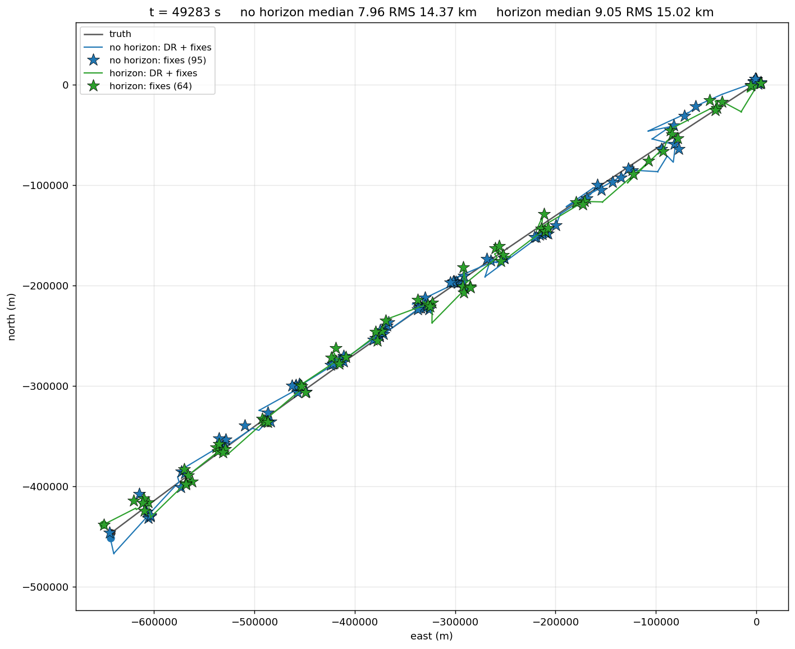
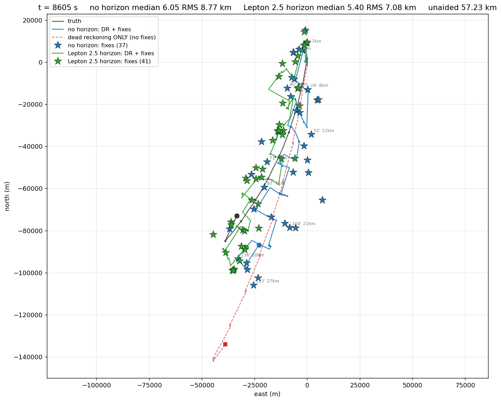
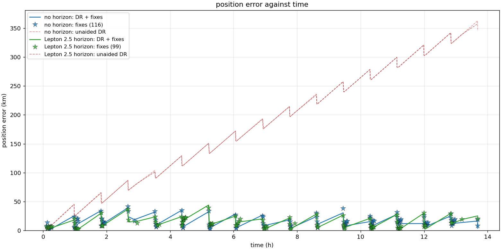
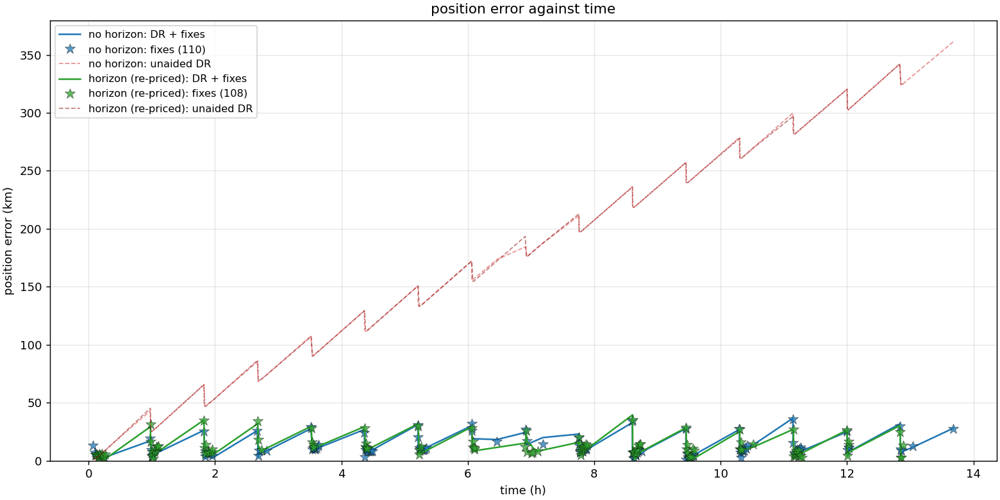
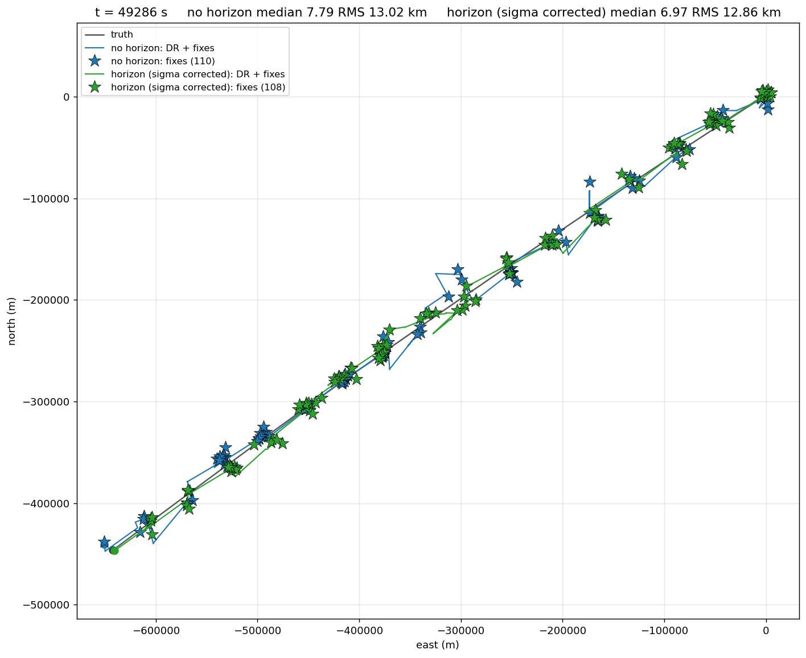

# Results

Measurements from a single session, 2026-09-10. Each section says what was
measured, on what, and how far it can be trusted. Where a result rests on one
run rather than a sweep, it says so — this project's own rule is to quote a
seed sweep, not a run, and two of the three findings below do not yet meet it.

Reproduce with the commands given under each section.

---

## 1. The exposure floor — the one result that is fully swept

**`min_exposure_s` 0.020 → 0.100 in `tools/pipeline.hpp`.**

The auto-exposure controller holds star smear at a setpoint
(`target_smear_px = 8.0`) by *shortening* exposure. In a turn that trades
photons for sharpness without limit. Measured in SITL at a 250 m loiter
(5.7 deg/s): the controller wound 200 ms down to 35 ms and detections went
43 → 0, costing every fix for the rest of the flight.

Swept in `transit_scenario --imaging`, which is seeded and deterministic:
**144 runs**, 4 exposures × 3 fix-orbit radii, 10–20 seeds per cell.

| exposure | mean smear | matched stars/frame | frames unusable | fix error |
|---------:|-----------:|--------------------:|----------------:|----------:|
|    20 ms |     1.2 px |                 4.2 |          6.03 % |  13.95 km |
|    50 ms |     3.0 px |                12.0 |          0.00 % |   6.73 km |
|   100 ms |     6.0 px |                24.8 |          0.07 % |   6.61 km |
|   200 ms |    12.0 px |                44.8 |          0.00 % |   6.84 km |

Two things to read off this:

* **There is a cliff below ~50 ms**, and the controller was sitting in it.
  20 ms costs 2.1× the fix error of anything above.
* **Above 50 ms it saturates.** 50/100/200 ms are statistically
  indistinguishable (spread 0.23 km against sd ≈ 2.3, SE ≈ 0.42, n = 30).
  The extra 33 matched stars from 50 → 200 ms buy nothing, because past that
  point attitude is the constraint and not the star pipeline.

So 100 ms is **not** tuned for the best number — it is set to stay off the
cliff with 3× margin while sitting mid-plateau. A floor rather than a larger
`target_smear_px` because the smear setpoint must be re-derived for every turn
rate (8 px means 35 ms at 5.7 deg/s) whereas the floor holds regardless.

**Smear is not the thing to minimise.** The 200 ms cell runs at 12 px of smear
and has the most matched stars of any cell: the matched filter takes the streak,
and photons are what is scarce. Lowering smear was actively the wrong direction.

Fix-orbit radius (150/250/400 m) changed fix error by less than the noise
(6.47–6.93 km), so the conflicting `WP_LOITER_RAD` in `cns_sitl.parm` (400) and
`cns_demo.parm` (250) does not matter for fix quality.

Effect end to end, same Canberra mission before and after:

| | 35 ms floor | 100 ms floor |
|---|---|---|
| fixes | 3 | **35** |
| fixes span | t = 243–363 s only | t = 396–8132 s (whole flight) |
| minimum exposure reached | 35 ms | 100 ms (never below) |
| detections through turns | 0–3 | median 45 |
| boresight calibration | never ran (0.4000°) | 0.1851° → 0.0305° |


Grey is truth, blue is dead reckoning corrected by celestial fixes, red dashed
is dead reckoning alone.

```
cmake --build build -j
python3 tools/run_sitl_test.py --ardupilot ~/ardupilot
```

---

## 2. Bounded versus unbounded over 830 km

Sagres → Porto Santo, 799 km of mission plus fix orbits, 13.7 h simulated,
GNSS denied 240 s after takeoff. December epoch so the crossing sits in real
darkness. Camera is zenith-pointing, so the sky overhead is set by latitude and
sidereal time; flight direction does not change which stars are visible.


The sawtooth is the mechanism: error grows along each leg and collapses at each
fix orbit. Unaided dead reckoning climbs without limit; the aided track never
escapes its band.

| night window (≤ 06:00 UTC) | fixes | fix error median | aided error median | unaided, final |
|---|---:|---:|---:|---:|
| no horizon | 82 | 10.57 km | 7.49 km | 272.8 km |
| horizon    | 48 | 10.38 km | 9.11 km | 261.5 km |

**A ~25× separation between aided and unaided** — and that is the claim the
system exists to make.



Two caveats that matter for reading these numbers:

* **Fixes are not injected.** The node runs `--no-inject`, so the autopilot
  never uses them; it flies on its own GNSS-denied EKF3. That is why the
  aircraft's *true* closest approach to the final waypoint was 18.6 km — that
  figure is EKF3's own navigation drift over 13.7 h, not the celestial system's
  error. The celestial estimate is a passive observer throughout.
* **The sky model does not brighten.** `sky_mag_per_arcsec2 = 21.5` is a fixed
  moonless dark sky. A headwind stretched the crossing from a planned 8.9 h to
  13.7 h, which runs ~2.7 h past astronomical dawn, so the night-window figures
  above are quoted separately from the full-crossing ones for exactly that
  reason. Over the full crossing the aided medians are 7.96 km (no horizon) and
  9.05 km (horizon) against an unaided median of 178 km.

```
python3 tools/make_mission.py --lat 37.0086 --lon -8.9480 --track 237.0 --fan 0 \
    --legs 16 --leg-km 50 --radius 250 --turns 2 > missions/sagres_portosanto.waypoints
python3 tools/run_sitl_test.py --ardupilot ~/ardupilot \
    --mission missions/sagres_portosanto.waypoints \
    --location 37.0086,-8.9480,60,237 --utc 2024-12-15T19:00:00 \
    --horizon-compare --run-name portosanto --max-minutes 120
```

---

## 3. The horizon sensor — a bug, then a real result

**`celestial_node` silently ran a horizon sensor even without `--horizon`.**

`HorizonConfig` default-constructs with ONE camera — a FLIR Boson 640 — not an
empty vector, and nothing clears it:

```
default PipelineConfig.horizon.cameras.size() = 1
  camera[0]: width=640 hfov=32.0 deg edge_sigma_px=0.50
```

`tools/pipeline.hpp` states "Empty `cameras` disables it, which is the default".
That describes the intent; it was not what the code did. Three consequences:

* Every `--horizon-compare` run in this session was **Boson 640 vs Lepton 2.5**,
  not horizon vs none.
* **`--horizon` was a downgrade.** Tilt floor by resolution — `edge_sigma_px`
  over `width` columns:

  | core | deg/px | tilt floor | as position |
  |---|---:|---:|---:|
  | Boson 640, 32° (silent default) | 0.050 | **0.06 arcmin** | 0.1 km |
  | Lepton 2.5, 51° (`--horizon`)   | 0.637 | 5.13 arcmin | 9.5 km |

  Measured per-frame celestial fix, one flight, 78 000 frames per arm:
  **10.04 km median with the Boson against 16.46 km with the Lepton** — the
  Lepton is 64 % worse, which is what those floors predict.
* `pipeline.cpp`'s `cameras.empty() ? 6000.0 : 2700.0` fix sigma **never took
  the 6000 branch**, so both arms were priced identically.

`transit_scenario` is not affected — it calls `hc.cameras.clear()` before adding
cameras, so its "no horizon" really is none. That reconciles this with the
measured table in `tools/pipeline.cpp`, which shows the Lepton *helping*
(6.2 → 2.7 km at a 360° sweep) against a true no-horizon baseline. Both hold:

* **Lepton against nothing** — helps, ~2.3× at full sweep.
* **Lepton against a Boson 640** — hurts, 64 % on the per-frame fix.

Fixed in `tools/celestial_node.cpp` by clearing `cameras` at startup, so
`--horizon` and `--horizon-pair` are the only ways to enable one.

Every horizon conclusion drawn before that fix is withdrawn, including a
"re-pricing" experiment that changed one arm's sigma from 2700 to 5240 while
believing the other was at 6000 — both were at 2700, so its ~1 km deltas had no
mechanism behind them and sat inside the run-to-run spread.

### Measured properly, the horizon sensor helps

Re-run on the Canberra mission with the fix in place, so the unaided arm really
has no horizon and `sigma_full` takes its 6000 branch for the first time. One
flight, two nodes, identical telemetry:

| arm | fixes | per-frame fix | orbit fix | filtered median | RMS | p90 |
|---|---:|---:|---:|---:|---:|---:|
| no horizon | 37 | 30.74 km | 10.43 km | 6.05 km | 8.77 | 15.16 |
| 1× Lepton 2.5 | 41 | **16.35 km** | **7.32 km** | **5.40 km** | **7.08** | **11.06** |
| delta | +4 | **−46.8 %** | **−29.8 %** | −10.8 % | −19.3 % | −27.0 % |

**Every statistic improves, p90 included.** That is what separates this from the
earlier comparisons in this session, where the median moved one way and the tail
the other — the signature of noise rather than effect. It also agrees in
direction with the measured table in `tools/pipeline.cpp` (6.2 → 2.7 km at a
360° sweep); the smaller margin here is consistent with that table having been
taken on a calibrated mount while this mission departs at 0.40° uncalibrated.




Repeated on the 883 km Sagres → Porto Santo crossing, a mission 6× longer with
far more dead reckoning between fix orbits:

| delta, Lepton 2.5 against no horizon | orbit fix | per-frame | DR median | RMS | p90 |
|---|---:|---:|---:|---:|---:|
| Canberra, 152 km       | **−29.8 %** | −46.8 % | −10.8 % | −19.3 % | −27.0 % |
| Porto Santo, 883 km    | **−33.0 %** | −32.7 % | −20.5 % | ±0 % | +3.5 % |
| Bluff → Snares, 205 km | −12.9 % | — | **−41.3 %** | **−40.7 %** | −31.6 % |

**The fix-quality improvement reproduces: ~30 % on both.** Two independent
missions agreeing on the metric the sensor directly acts on is the strongest
horizon result here.

The Snares crossing is the outlier and the interesting one: the smallest gain
on the fix itself (−12.9 %) but by far the largest on the filtered track
(−41 % on both median and RMS). It is also the hardest navigation problem of the
three — a 205 km leg where unaided dead reckoning reached 98 km, 48 % of the
distance flown, because a short flight gives the wind estimate no time to
settle. The tentative reading is that the horizon matters most where the dead
reckoning it is correcting is worst, which is not the same thing as where the
sky is best.

The *filtered* track is a weaker and less consistent story. The median improves
in both (−10.8 %, −20.5 %) but the tail does not: on Porto Santo the RMS is
identical (13.36 vs 13.37 km) and p90 is marginally worse. Read that as **the
horizon improves the typical fix, not the worst case** — which is what you would
expect of a sensor that reduces random tilt error but cannot help when a fix
window is poorly conditioned for other reasons.



How far to trust it: the per-frame and orbit-fix improvements are far outside
this simulator's run-to-run spread, reproduce across two missions, and are safe
to quote. The filtered-track numbers are the same order as the spread and should
not be quoted as percentages. A seed sweep remains the thing that would settle
the magnitude, and none of this was run under one.

## 4. Would it actually find the island?

The practical question a navigation result has to answer. The navigator steers
so the celestial estimate lands on Porto Santo; the aircraft is really at truth,
so when it believes it has arrived **the island lies at |estimate − truth| away
— the position error IS the miss distance.**

Detection thresholds, aircraft at 800 m AMSL, Porto Santo's Pico do Facho at
517 m, clear December night:

| threshold | distance | meaning |
|---|---:|---|
| island length | 11 km | effectively overhead |
| town lights, Vila Baleira | ~50 km | realistic night detection |
| sea horizon from 800 m | 101 km | island body visible |
| 517 m peak over that horizon | 182 km | peak only, marginal |

Sagres → Porto Santo, 882 km flown, both arms on one flight (see section 3 for
what the two arms actually were):

| arm | final-hour median | verdict | p90 | verdict |
|---|---:|---|---:|---|
| Boson 640 | 11.53 km | YES — town lights in range | 25.86 km | YES |
| Lepton 2.5 | 10.56 km | OVERHEAD — island fills the search area | 27.12 km | YES |

**Both find the island, and the choice of horizon core does not change the
answer.**
Both arms land within ~11 km of a target detectable from ~50 km, and even the
p90 worst case (~26 km) is comfortably inside visual range. On this evidence the horizon core is not what
decides whether the crossing succeeds; that argument has to be made on fix
quality or on cost, not on landfall.





### Re-flown with no horizon at all

The table above compares a Boson 640 against a Lepton 2.5 (see section 3), so it
does not answer "what if there is no horizon sensor". Re-flown on the same
883 km crossing with the fix in place, so one arm genuinely has none:

| arm | final-hour median | verdict | p90 | verdict |
|---|---:|---|---:|---|
| no horizon | 10.97 km | **OVERHEAD** | 23.90 km | YES — lights |
| 1× Lepton 2.5 | 18.75 km | YES — lights | 24.74 km | YES — lights |

**Both configurations find Porto Santo**, and with margin: the worst case in
either is ~25 km against a ~50 km night-lights detection range and a 101 km sea
horizon. Removing the horizon sensor costs ~30 % on fix quality (section 3) but
does not change whether the aircraft makes landfall on an 11 km island after
883 km of GNSS-denied flight.

The section-2 headline — bounded ~10 km against unbounded 272 km — is unaffected
either way, because it never depended on the horizon configuration.

### A target small enough to miss

Porto Santo is 11 km long with a town on it, so both configurations found it
with 2× margin and the test could not fail. The Snares, 205 km south-west of
Bluff, New Zealand, is **3.5 km long, uninhabited, 130 m high** — no lights, and
smaller than the navigation error. Same flight, both arms:

| at the final fix | estimate error | estimate's distance from the island |
|---|---:|---:|
| no horizon | 20.04 km | 23.30 km |
| 1× Lepton 2.5 | **12.35 km** | **15.33 km** |

**Both miss.** Steering on either estimate the aircraft does not arrive at the
Snares; the horizon arm misses by less. This is the first target in the set
where the answer is not "yes with margin", and it marks where the system as
configured stops working: **a target under ~10 km, unlit, is beyond it.**


The aircraft's own track (white) passes 6.18 km from the island — that is EKF3
flying the mission blind, not the celestial estimate, which is a passive
observer throughout (see the `--no-inject` note above).

A statistical warning attached to this run, because it caught us three times in
one session: `dr_err_m` is a SAWTOOTH sampled only at fixes, so a median over a
short final window can land in a trough and read far better than the endpoint.
On this flight the last 30 minutes give 1.99 km for the horizon arm against a
20 km endpoint — a number that looks like a triumph and describes nothing.
Quote the whole-flight median, RMS and p90, or the endpoint, and say which.

---

## 5. Harness fixes needed to run any of this

The unattended SITL test could not start. Both were silent failures.

* **`--out` is a MAVProxy option.** `sim_vehicle.py` consumes it only inside
  `start_mavproxy()`, and `--no-mavproxy` returns before that, so both `--out`
  flags were discarded and nothing arrived on either port. Replaced with
  `-A --serial1=udpclient:...`, which passes the argument to the ArduPlane
  binary where `--serial1` is a real MAVLink port.
* **SITL blocks at startup** until a client connects to SERIAL0's TCP port.
  MAVProxy is normally that client; with `--no-mavproxy` the script must be, or
  the simulator never starts and *no* link produces a byte — which looks like a
  node fault and is not.
* **SITL persists parameters in `./eeprom.bin`**, so the GNSS denial performed
  by one run was still in force at the next boot: "TIMEOUT waiting for GPS 3D
  fix" and a refused arm, with nothing to say why. Now launched with `-w`.
* **ArduPlane runs in its own process group** via `run_in_terminal_window.sh`,
  so killing `sim_vehicle`'s group does not reliably take it down. The script
  now reaps strays explicitly, touching only PIDs that appeared after it started.

Also added: `--run-name` (per-run output directory, so a crossing that cost an
hour is not overwritten by the next run), `--location`, `--utc`,
`--horizon-compare`, `--fix-sigma`, `make_mission.py --fan`, and
`live_view.py --save` / `--no-dr-open`.
