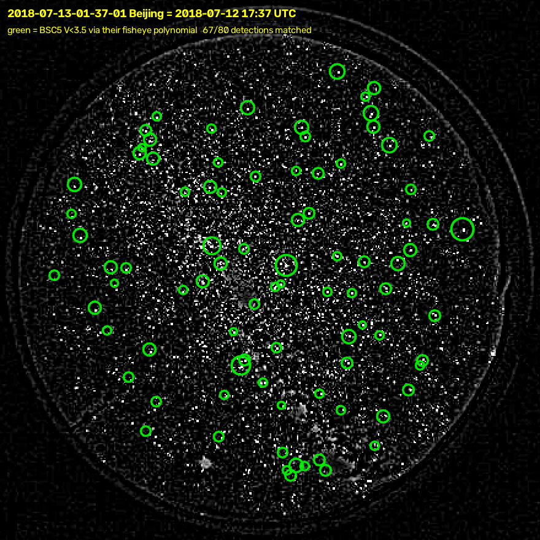
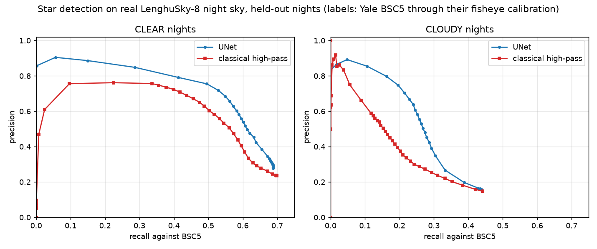

# scripts/

Off-repo experiments. Nothing here is on the flight path, and nothing here is
built by CMake.

## Should there be a network here at all?

A UNet stub used to live in this directory, ported from Teague & Chahl (2026)
on the strength of their reported F1 0.77 under cloud. It was removed after the
question was actually measured. The measurement is below; it changed the answer
twice.

### What cloud and flare actually cost

Matched stars per frame, six frames per condition (`/tmp` probe, reproduced in
`testMeshBackground`):

| condition | matched | vs clear |
|---|---|---|
| clear | 38.3 | 100% |
| cloud: glow + attenuation | 25.8 | 67% |
| cloud: GLOW only | 31.5 | 82% |
| cloud: ATTENUATION only | 33.0 | 86% |
| **flare only** | **19.3** | **50%** |

Two things fall out. **Lens flare is the dominant contaminant**, worse than
cloud, and it is purely additive -- a smooth gradient with no attenuation.
Cloud's damage splits roughly evenly between glow and attenuation.

### A 60-line classical mesh takes the flare

A SExtractor-style background -- sigma-clipped estimate per 64 px cell, median
filtered across nodes, bilinearly interpolated, subtracted:

| condition | plain | mesh | gain |
|---|---|---|---|
| clear | 38.3 | 36.8 | 0.96x |
| cloud 0.6 | 25.8 | 26.2 | **1.01x** |
| flare 0.5 | 19.3 | 34.0 | **1.76x** |
| cloud + flare | 13.8 | 24.2 | 1.75x |

It recovers nearly all of the flare loss and **does nothing whatever for
cloud**. That is now in the library as `DetectorConfig::bg_mesh_px`.

### Why the neural background estimator is not obviously worth building

The plan was: predict the background field with a small network at 1/8
resolution, subtract, hand the residual to the classical detector. Attractive
because a 1/8-resolution output structurally CANNOT delete a 2 px star, and it
is ~64x less compute than full-resolution segmentation.

The measurement undercuts it. The additive component -- the part any background
estimator can address -- is already taken by the classical mesh. What is left is
cloud, and **cloud damage is not a background problem**. It attenuates
starlight, which is photons that never arrived, and its glow raises the SHOT
NOISE floor (sigma^2 ~ B). Subtracting a background cannot un-add Poisson noise.
That was the mechanism I had wrong: I assumed cloud hurt mainly through
threshold bias, and it does not.

So a learned background estimator would have to beat the mesh's 1.76x, not beat
nothing. On this evidence it has very little room.

### What would still justify a network

**Sharp cloud edges.** A median mesh smooths across a discontinuity and leaves
residuals on both sides, where a network sees the edge as an edge. The cloud
model here is a sum of smooth sinusoids and has no sharp edges at all, so this
simulator is structurally incapable of showing that failure -- which is exactly
the limitation that makes the result above provisional.

**Faint-star recovery under attenuation.** A segmenter can in principle use
context to accept a low-SNR detection a threshold would reject. That is the one
thing genuinely outside the classical pipeline's reach.

**Their real-data result.** Teague & Chahl report 85.9% identification on real
flight data, +23.3% over the baseline. That is a measurement on real sky and it
stands regardless of anything here.

### The stub is back, with a safety property

`train_unet.py` returns, but its output is a **prior**, not a decision. It feeds
`DetectorConfig::prior`, which lowers the detection threshold between
`threshold_k` and `threshold_k_low`:

    k(x,y) = k_high - (k_high - k_low) * p(x,y)

The detection still has to clear a real significance floor computed from actual
photons, and the centroid is always measured on the original image. So the
network **cannot hallucinate a star** -- a confident prediction over empty sky
produces nothing, because there is no flux to exceed even k_low -- and it
**cannot delete one**, because a zero prior leaves the nominal threshold
untouched.

`testPriorIsBounded` asserts the exact equivalence:

| prior | equivalent to |
|---|---|
| 1 everywhere | hand-setting `threshold_k = threshold_k_low` |
| 0 everywhere | the ordinary detector, unchanged |

Measured: 25 detections / 21 matched, and 7 / 7, matching the hand-set
thresholds exactly in both directions. **The worst an adversarial model can do
is move you to an operating point you could have chosen yourself.** That is a
bound on the damage, and it holds with no assumption that the model is good.

This is the reason a segmentation network is defensible here while a network
that outputs detections directly is not. It also happens to be the mechanism
that suits the one job genuinely outside the classical pipeline's reach --
accepting a low-SNR detection under attenuation that a fixed threshold would
reject, which is precisely "lower the bar where there is reason to".

### Running it: PriorNet

`include/celestial/prior_net.hpp` loads the exported ONNX through `cv::dnn` and
produces the prior. Verified end to end against a hand-built ONNX:

```
PriorNet::available() = true
load(missing file)    = false          <- graceful
infer without model   = false, prior empty
load(toy model)       = true
first call after load = 17.3 ms
inference (steady)    =  7.3 ms        <- at 1/4 resolution
prior                 = 2354176 values, range 0.0004-0.9990
matched: no prior 10, with prior 17
```

Inference runs on a DECIMATED image and the prior is upsampled. That is not
only for speed: a coarse prior cannot target an individual pixel, so the model
is structurally incapable of fine-grained mischief even inside its permitted
range. 7.3 ms sits comfortably inside the 100 ms frame budget alongside the
24.8 ms matched filter -- check `./build/bench` before scaling the model up.

**Warm up at load, not in flight.** `cv::dnn` initialises layers, allocates
buffers and selects implementations lazily on the first forward pass, so an
un-warmed model costs **165 ms on frame one** against 7 ms thereafter. On an
aircraft that lands on whichever frame happens to be first. `PriorNet::load`
runs a dummy pass to pay it up front. (An earlier version of this note quoted
17.8 ms as the inference cost; that was a first-call measurement and wrong in
both directions.)

**OpenCV 5 is the target, 4.6 is what was tested.** Only the stable subset is
used -- `readNetFromONNX`, `blobFromImage`, `forward`, `resize` -- which is
unchanged between 4.x and 5.x, so both work. One deliberate detail: PriorNet
does NOT call `setPreferableBackend` or `setPreferableTarget`. OpenCV 5 ships
three DNN engines behind one API and defaults to `ENGINE_AUTO`, trying the new
graph engine first and falling back to the classic one; the new engine is where
the 80%+ ONNX coverage, shape inference and operator fusion live. Pinning a
backend forces the classic engine, which is only correct if you want CUDA or
OpenVINO and is a straight loss on CPU. Leaving both unset gets the best
available engine on 5 and identical behaviour on 4.

**OpenCV is optional.** `find_package(OpenCV QUIET)`; without it PriorNet
compiles to a stub that reports unavailable and every caller falls through to
the ordinary detector. Both builds are tested (`testPriorNetFallback`). It is
used for exactly one thing -- ONNX inference, so a learned model does not drag
in a second runtime -- and NOT for thresholding, connected components,
centroiding, the matched filter or the mesh background, all of which are
hand-written because each is measured and documented and a library call would
lose the reasoning.

### The order of work

1. Enable `bg_mesh_px` where flare is expected. Free, already done, 1.76x.
2. Temporal median across frames -- stars move with attitude, flare and hot
   pixels do not. Cheap, classical, and targets the same contaminant from a
   different angle.
3. Get real night-sky footage. Everything below this line is unfalsifiable
   without it.
4. Add sharp-edged cloud to the renderer, since the current model cannot
   produce the failure a network would fix. LenghuSky-8 CANNOT donate those
   edges -- measured, see option (b) below. This still needs real footage.
5. Only then the learned prior, benchmarked against the mesh -- 1.76x under
   flare is the number to beat, not zero. Partial evidence now exists that a
   learned detector helps under REAL cloud (1.29x on best F1, 1.5x recall at
   precision 0.40), but on someone else's camera with no motion smear, and it
   is LESS than the mesh is worth under flare -- see "(a), done" below.

`tools/gen_dataset` writes the image/mask pairs, and the labels (`StarLabel`:
centroid, both streak endpoints, truncation flag) are exact.

## Trained on real cloud: LenghuSky-8

`fetch_lenghusky8.py`, `train_cloud_unet.py`, `export_onnx.py`, and a venv in
`scripts/.venv`. Nothing here is built by CMake and nothing is on the flight
path.

This is the first thing in this directory that is not circular. Everything
above this line is a model trained on cloud we invented and evaluated on cloud
we invented.

### 22 MB, not 84 GB

`data/segmentation.zip` embeds every annotated image as base64 inside its own
labelme JSON, so it carries all 1,111 images AND all 1,111 label sets. The 100
image tars (~20 GB) and 100 DINOv3 logit tars (~40 GB) are not needed and were
not fetched. The raw 4096x4096 frames (~5 TB) are not published at all.

The GitHub README says "252 images used for benchmarking"; that is a subset.
The zip holds 1,111, which is the number the paper quotes.

### The polygons are not exhaustive, and this is the thing to get right

    sky 0, cloud 1, contamination 2, UNLABELLED 3 = ignore

Median 2 polygons per image; the rest of the frame carries no label. An
unlabelled pixel means "the annotator did not say", NOT "sky". Filling the
background with class 0 would train the model to call every ambiguous region
sky and then score it against a label nobody wrote. Upstream's
`train_segmentation_Unet.py` initialises the mask to 3 and fills polygons over
it, so `CrossEntropyLoss(ignore_index=3)` drops those pixels from the loss AND
from the metrics. Reproduced exactly.

7 of the 2,846 polygons carry a misspelled label (`contination`,
`contimination`, `clode`). Mapped rather than dropped; dropping them silently
deletes labelled area.

### Split by night, not by file

Upstream's `bootstrap_segmentation.py` shuffles the 1,111 files and cuts
80/10/10. But the frames cluster in time -- 249 distinct dates, a median of 3
images per date, and 226 consecutive pairs less than an hour apart. Cloud does
not reorganise itself in an hour, so a random cut puts near-duplicate frames on
both sides of the wall.

`--split group` holds out whole dates and asserts no date appears twice. It is
the same lesson `train_unet.py` already records for the synthetic data ("SPLIT
BY TRAJECTORY, NOT BY FRAME"), which is some comfort that it is a real effect
and not special pleading.

`--split random` reproduces upstream's protocol so the gap between the two can
be measured. **That run was killed part way through and produced no result, so
the leakage gap is unmeasured. Do not quote one.**

### The number

1.96 M parameters, 4 down / 4 up, 16 base channels -- about 16x narrower than
upstream's 64-channel baseline. 150 epoch cap, best at epoch 116, ~30 minutes
on an RTX 5060 laptop GPU at 99% utilisation. Held-out **dates**, one seed:

| class | precision | recall | F1 | IoU | labelled px |
|---|---|---|---|---|---|
| sky | 0.960 | 0.957 | **0.958** | 0.920 | 3 455 987 |
| cloud | 0.877 | 0.954 | **0.914** | 0.841 | 2 357 995 |
| contamination | 0.768 | 0.484 | 0.594 | 0.422 | 528 606 |
| macro | | | 0.822 | 0.728 | |

**Overall pixel accuracy 0.9163.**

The paper reports 93.3% +- 1.1% for a linear probe on DINOv3 features. That is
NOT a like-for-like comparison -- different model class, a random rather than
grouped split, and their figure is bootstrapped over seeds where this is a
single seed. Treat 91.6% as evidence that a 2 M-parameter UNet lands in the
right neighbourhood, not as a claim to have matched them.

Contamination is the weak class at 0.484 recall. It is 8% of labelled pixels
and it is a grab bag -- moon, dome, frost, satellite trails -- so one class id
is being asked to cover several appearances.

### ONNX, and the one place OpenCV 4.6 and 5.0 actually diverge

The UNet upsamples with `size=` taken from the skip connection rather than
`scale_factor=`, so odd spatial dimensions survive the round trip. That matters
because `PriorNet::infer` decimates the flight frame by 4 and runs on
1936x1216 / 4 = 484x304, which is neither 512 nor a power of two. It also emits
a `Shape` node, and there the two importers part:

| export | OpenCV 5.0 | OpenCV 4.6 |
|---|---|---|
| dynamic axes (default) | loads | **refuses**, `parseShape: !isDynamicShape` |
| `--static 484 304` | loads | loads |

With a fixed input size the exporter constant-folds `Shape` away. Both variants
are written and both were checked by loading them under the cv2 they target;
agreement with torch is 1e-5 max absolute on the logits.

Inference at 484x304, measured:

    OpenCV 5.0   24.2 ms/frame
    OpenCV 4.6   46.9 ms/frame

which is the first direct confirmation of the claim made further up this file
that OpenCV 5's graph engine is worth having. It also **does not fit the frame
budget**: 46.9 ms on the installed 4.6, against a 100 ms budget already
carrying a 24.8 ms matched filter. base=16 at 1/4 decimation is too big. Shrink
the model or decimate harder before this is a flight proposition.

### Four reasons this is not a drop-in prior

It is a cloud segmenter. It is not a star detector -- there are no star labels
anywhere in LenghuSky-8, so nothing in it has ever seen a star as a target.
Between it and `DetectorConfig::prior` stand four things, each a deliberate
non-decision:

1. **Domain.** All-sky fisheye, fixed mount, multi-second exposures at an
   observatory. The flight sensor is 53.5 deg, moving, 0.1 s, with smear.
2. **Channels.** Trained on 3-channel RGB; `PriorNet::infer` hands cv::dnn a
   1-channel 16-bit mono frame. `train_cloud_unet.py --gray` exists for this
   and has not been run.
3. **Scale.** This model wants float in [0,1]. `PriorNet` calls
   `blobFromImage(small)` with the default scalefactor 1.0 on a CV_16U frame,
   so it would feed 0..65535.
4. **Semantics.** `prior` means P(star here) and a high prior LOWERS the
   threshold. This model emits P(sky), P(cloud), P(contamination). Which maps
   to which is a real design question with two opposite answers: P(sky) says
   "be permissive where it is clear", while this file argues the only thing
   outside the classical pipeline's reach is the reverse -- recover faint stars
   under thin cloud. Not decided here, because it should be decided by
   measurement.

And the standing objection is unaffected: cloud damage is attenuation plus a
raised shot-noise floor. Knowing exactly where the cloud is does not
un-attenuate the starlight. A perfect cloud mask still has to prove it buys
detections.

### What it does establish

Cloud appearance on real night sky is learnable to F1 0.914 by a 2 M-parameter
model in half an hour on a laptop. That is worth knowing and it was not known
before. It is not a flight result and must not be quoted as one.

## Can we paste synthetic stars onto these images and train a detector?

Asked directly, and the honest answer is "not that way, but there is a better
way sitting right next to it". Four measurements, all cheap, all made:

**1. The frames already contain real stars, and they are unlabelled.** A
high-pass of the disc centre stretched to 6 sigma shows hundreds of compact
1-2 px sources per 100x100 patch -- about the density expected for V < 5 at
this plate scale. So compositing synthetic stars and labelling only those would
mark every REAL star as background. That is not merely noisy supervision, it is
inverted: the detector would be trained to suppress exactly the signal it
exists to find. Worse than nothing.

**2. The plate scale is wrong by 15x.** The fisheye disc is ~400 px across for
~180 deg, so ~1624 arcsec/px against the flight camera's 107. A 53.5 deg flight
field spans ~119 px of this image and would have to be upsampled ~16x to reach
1936 px. Everything below ~0.45 deg would be invented, which is precisely the
regime a star detector operates in.

**3. The pixels are not radiance.** 8-bit, JPEG, downsampled 8x from 4096, and
S3-enhanced with a per-frame [mean-1sigma, mean+3sigma] clip. The blocking
artefacts are plainly visible in the high-pass. Poisson shot noise -- the
mechanism by which cloud actually destroys detections -- has been erased and
replaced by compression texture. A detector trained on this would learn JPEG.

**4. But the astrometric calibration is published.** `data/calibration.zip` is
6 KB: site 38.9586 N, 93.2681 E, 4200 m, and six time-slotted fisheye
solutions, each an odd-order polynomial in zenith angle with an optical centre
and an azimuth offset, fitted at 4096.

Which points somewhere better than pasting. Two options were considered; only
(a) survived measurement.

**(a) Label the REAL stars.** Site plus timestamp plus their calibration
polynomial projects the Yale BSC5 catalogue -- which this project already
carries, along with all the astrometry -- onto each frame. That yields real
stars, seen through real cloud, with labels derived rather than invented, and
no synthetic star anywhere. It is self-validating: project the catalogue,
compare against the detected point sources, and if they do not line up the
calibration is wrong and you know immediately. Cost is recovering the
crop-and-resize convention that took 4096 to 512, mapping each frame to its
calibration slot, and handling the roof-position change. Problems (2) and (3)
remain -- wrong plate scale, no photometry -- so this trains a detector for
THEIR camera, not ours. Its value is as a transfer check and as the first
honest measurement of how much cloud costs a real detector.

**(b) Use the images as a morphology donor for our own renderer. MEASURED AND
WITHDRAWN.** The proposal was: strip the stars with a median filter, normalise
what is left to an opacity field, crop a 53 deg patch, and feed it to
`renderFrame` in place of the sinusoid `c(x,y)` at src/imaging.cpp:291. The
renderer would still do the physics -- multiplicative attenuation, additive
glow, Poisson noise on the resulting flux -- and labels would still be exact
from `StarLabel`, so only the cloud SHAPE would be borrowed. It was pitched as
step 4 of "the order of work", real edges instead of invented ones.

It does not survive its own measurement. Edge strength as |grad| p99 on the
normalised opacity field, 360 random crops from 120 cloud-labelled frames
against 60 realisations of the sinusoid model:

| field | \|grad\| p99 |
|---|---|
| real cloud, native 1624 arcsec/px | **0.409** |
| real cloud stretched to a 53.5 deg flight field | **0.165** |
| sinusoids, `cloud_scale_px` 300 (the default), decimated by 4 | 0.363 |
| sinusoids at scale 150 | 0.179 |

Real cloud IS sharper than the simulator -- at its own plate scale. Filling a
53.5 deg field at 107 arcsec/px means stretching a 119 px crop across 1936 px,
and after that upsample it is less than half as sharp as what the sinusoids
already produce, landing on the existing model at scale 150. The star-removal
median contributes (0.241 unfiltered, 0.201 at 3, 0.165 at 5) but the upsample
dominates.

A donor cannot supply structure it never sampled. The general form, which is
the useful part:

**LenghuSky-8 cannot inform the cloud model at the flight camera's scale, in
either direction.** It cannot say the sinusoids are too sharp or too smooth,
because it never resolved cloud at 107 arcsec/px over 53.5 deg. Step 4 of the
order of work still needs footage from the airframe.

Neither replaces night-sky footage from the actual airframe, which remains the
highest-value thing to collect on the first flight.

## (a), done: a UNet finds stars through cloud that a threshold does not

`lenghu_astrometry.py` builds the labels, `unet_star_test.py` trains and
scores. **Proof of concept, parked. It does not go into the navigation system
and it is not a candidate to.** What it establishes is one narrow thing that
was previously only asserted.

### The labels are derived, not invented

BSC5 projected through LenghuSky-8's own fisheye calibration for the site and
time. Three things had to be reverse engineered first -- the timestamps are
Beijing time, the image y axis is flipped, and the 4096 -> 512 mapping is a
plain 0.125 resize with no crop. Full account at the top of
`lenghu_astrometry.py`. Label positions land within 0.7-2.3 px depending on
calibration epoch; the 2019-07-05 epoch never locked on and is excluded.

Crucially the labels do NOT depend on whether a star is visible. A star behind
thick cloud is still labelled at its true position, and both detectors are
scored against the same labels, so whatever the cloud takes away it takes from
both.



Green rings are BSC5 to V 3.5 placed by the calibration alone -- no fitting to
this frame. The speckle is the high-passed image; the 8 px chequer behind it is
JPEG. 67 of the 80 strongest detections land on a catalogue star.

**Why the labels can be trusted:** per-frame completeness of the classical
detector against them is sharply bimodal -- 38 frames at 90-100%, 53 at 0-10%.
A wrong plate solution smears toward chance and cannot produce two modes. The
low mode is overcast sky. By annotator label, median completeness is 61% on
clear frames and 22% on cloudy ones. And on one frame, at V<3.5, 31 of the 80
strongest detections match against a median of 1 over all 720 candidate
rotations -- so the solution is the global maximum, not a local one.

### The comparison

211 night frames over 82 nights, **split by night**, 55 test frames on 20
held-out nights of which 35 are cloudy. 1.96 M-parameter UNet, 1 channel in,
one heatmap out, Gaussian targets at sigma 1.2 px, BCE with pos_weight plus
dice because stars are ~0.05% of pixels. Peaks matched to catalogue within
3 px. Both detectors swept across their full threshold range and compared at
MATCHED PRECISION, not at whichever operating point flatters one of them.

**Score only where a label can exist.** Labels are cut at altitude 25 deg,
which through the fisheye polynomial is r = 162 px; the disc runs to 214. The
annulus between them is 42% of the disc area and it is exactly where the dome
rim and horizon glow sit. Scoring there counts every rim response as a false
positive -- and the rim is what a high-pass fires on hardest, while a trained
network has quietly learned from its labels that the rim is never a star. The
first version of this experiment did exactly that and reported gains up to 20x,
plus a spurious "the classical detector's precision caps at 0.42". Both were
the annulus. `EVAL_R` fixes it and the loss mask now matches the scoring mask.



Recall at matched precision, held-out nights:

| at precision | UNet | classical | gain |
|---|---|---|---|
| **CLEAR nights** (20 frames, 4071 stars) | | | |
| >= 0.25 | 0.688 | 0.672 | 1.0x |
| >= 0.30 | 0.686 | 0.629 | 1.1x |
| >= 0.40 | 0.638 | 0.595 | 1.1x |
| best F1 | 0.610 | 0.550 | **1.11x** |
| **CLOUDY nights** (35 frames, 7057 stars) | | | |
| >= 0.15 | 0.439 | 0.421 | 1.0x |
| >= 0.25 | 0.333 | 0.293 | 1.1x |
| >= 0.30 | 0.305 | 0.243 | 1.3x |
| >= 0.40 | 0.287 | 0.186 | 1.5x |
| best F1 | 0.352 | 0.273 | **1.29x** |

**On clear sky the network is not worth having: 1.11x, and at loose precision
it is a dead heat. Under cloud it is worth something: 1.29x on best F1, rising
to 1.5x recall at precision 0.40.** The advantage is real, modest, and
concentrated exactly where it was predicted to be -- using context to accept a
low-SNR detection that a fixed threshold rejects. Predicted first in this file,
then measured on real sky, which is worth more than either alone.

For scale: the classical mesh background is worth **1.76x under flare**. On this
evidence a learned detector under cloud is worth less than the 60 lines of
SExtractor already in the library are worth under flare. That is the right
comparison to keep in mind before anyone proposes this for the flight sensor.

### What this does NOT show, and the list is not short

* **The baseline is a plain high-pass over a robust noise estimate**, not this
  project's `detectStars` with `bg_mesh_px` and the matched filter. It is the
  right incumbent for this data -- it is what solved the plate -- but the
  1.81x is NOT a measurement against our own detector.
* **No motion smear.** At 1624 arcsec/px sidereal drift needs 108 s to cross
  one pixel, so these stars are round points. Ours are streaks, and the matched
  filter exists for that. A network trained here has never seen the thing our
  detector is for.
* **15x wrong plate scale, and 8-bit JPEG rather than radiance.** Poisson
  statistics are gone, replaced by compression texture.
* **Recall is against the catalogue, not against detectable stars.** On
  overcast frames many labelled stars are physically absent from the image, so
  absolute recall understates both detectors. Only the ratio is meaningful.
* One seed, one split. No bootstrap.

### Reproducing the two figures

```bash
python3 scripts/fetch_lenghusky8.py
curl -L -o /tmp/c.zip https://huggingface.co/datasets/ruiyicheng/LenghuSky-8/resolve/main/data/calibration.zip
unzip -o /tmp/c.zip -d scripts/data          # -> scripts/data/calibrations/

scripts/.venv/bin/python scripts/lenghu_astrometry.py --selftest
scripts/.venv/bin/python scripts/lenghu_astrometry.py --solve
scripts/.venv/bin/python scripts/lenghu_astrometry.py \
    --overlay 2018-07-13-01-37-01 --label-mag 3.5 --stretch 14 \
    --out scripts/images/plate-solve-overlay.png

scripts/.venv/bin/python scripts/unet_star_test.py --epochs 150 \
    --plot scripts/images/star-detector-pr.png
```

Figures live in `scripts/images/`, deliberately NOT in `docs/images/` -- that
directory is the publishable set for the top-level README and RESULTS.md, and
nothing in this directory is a flight result.

* **The first run of this experiment was wrong** and reported up to 20x. The
  cause is written above rather than quietly corrected, because the failure
  mode generalises: score a learned model only where its labels can exist, or
  it gets credit for knowing where you did not label.

So: a learned detector beats a thresholded one under real cloud, at real
optical depths, with labels nobody hand-drew -- by about 30%. That is worth
knowing before anyone spends effort on a learned prior for the flight sensor,
and it is a much weaker result than the first pass claimed. It is not evidence
that it would work on the flight sensor.

## Real night-sky data

Synthetic training with real validation is the only version of this experiment
that means anything. Nothing below is a drop-in: they are all-sky fisheye
cameras on fixed mounts taking multi-second exposures, so they have no motion
blur, a completely different PSF and a much wider field. They are useful for
CLOUD APPEARANCE and as a transfer check, not as training data for a 53 deg
camera on a moving aircraft.

**LenghuSky-8** (arXiv:2603.16429, March 2026) is the best fit found, and is
now downloaded and trained on -- see "Trained on real cloud" below.
429,620 frames at 512x512 over eight years (2018-2025) from a premier
astronomical site, 81.2% night-time coverage, and -- the reason it matters --
**star-aware cloud masks**, background masks, and per-pixel altitude-azimuth
calibration. Manually labelled balanced subset of 1,111 images. Astrometric
calibration to ~0.37 deg at zenith.

**Dev et al., nighttime sky/cloud segmentation** (ICIP 2017),
github.com/Soumyabrata/nighttime-imaging. Much smaller, Singapore, segmentation
ground truth, code included. Good for a quick sanity check.

**LSST all-sky camera archive** (SMTN-005). 30 s exposures through every night,
~30 GB/night, Canon RGB Bayer, with SExtractor photometry of ~2000 bright stars
alongside sky brightness. Their own note is directly relevant to us: *in cloudy
conditions the coordinate solution fails and the stars become mis-identified* --
which is the failure mode this whole experiment is about. Access is via
`lsst-dev.ncsa.illinois.edu`, so not an anonymous download.

**What none of these give you** is night-sky footage from your airframe, with
your optics, at your frame rate, with real motion blur. That is the missing
input for validating the matched filter, for measuring the true star
identification rate, and for making any UNet result meaningful. It is the
highest-value thing to collect on the first flight.
